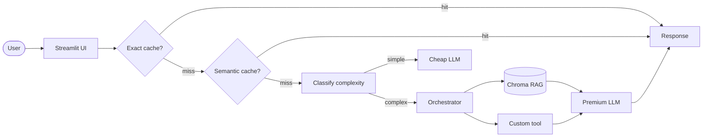

# TODO — Substitua pelo nome do seu projeto

> **TODO** — Substitua por 1 frase explicando o que o seu app faz e para quem.

<!-- TODO: cole aqui o GIF de demo (10-15s, <5MB) gerado com peek/terminalizer/OBS -->

**Live demo:** TODO — substitua pelo link do Streamlit Cloud / HuggingFace Spaces / FastAPI

## Problem statement

TODO — 3 linhas:

1. Qual problema voce resolve?
2. Para quem?
3. Por que LLM + RAG + Tool-use eh a abordagem certa (vs. busca simples)?

## Arquitetura



TODO — substituir pelo diagrama da SUA arquitetura se diferente.

## Setup

```bash
# 1. Clone (se nao clonou ainda)
git clone <seu-repo>
cd projeto-portfolio

# 2. Dependencias
uv venv && source .venv/bin/activate
uv sync

# 3. API key (escolha 1 provider em .env.example)
cp .env.example .env
# edite .env com sua key

# 4. Corpus
# Substitua data/corpus/*.pdf pelos seus documentos
# OU copie dos papers do M2:
# cp ../../../datasets/corpus/*.pdf data/corpus/

# 5. Rodar local
streamlit run src/ui/streamlit_app.py
```

## Cost & Latency

TODO — preencher apos rodar bench de 50 queries (veja notebook 05).

| Estrategia | Custo total | Reducao | P95 latency |
|---|---:|---:|---:|
| Baseline (premium sempre) | $X.XX | — | XX ms |
| + Exact cache | $X.XX | XX% | XX ms |
| + Semantic cache | $X.XX | XX% | XX ms |
| **+ Routing cheap-first** | **$X.XX** | **XX%** | **XX ms** |

Meta da rubrica (banda "excelente"): **≥50% de reducao** + P95 reportado.

## Design decisions

TODO — 3-5 bullets explicando decisoes NAO obvias:

- Por que escolhi este embedding model? (custo, idioma, tamanho do corpus)
- Por que `chunk_size` = X? (testei X', X'', e Y foi melhor por ...)
- Por que esta tool especifica? (problema X resolveria com Y, escolhi Z porque ...)
- Por que NAO incluo re-ranking? (corpus pequeno, latencia mais critica)

## Limitations

TODO — 3 bullets honestos:

- Limitacao 1 (e.g., corpus tem X paginas; performance degrada se subir para Y)
- Limitacao 2 (e.g., free tier do Gemini limita a 15 RPM)
- Limitacao 3 (e.g., demo nao suporta upload de PDF do usuario — corpus eh fixo)

## Tech stack

- **LLM:** Gemini 2.5 Flash-Lite (default) / GPT-4o-mini (alt)
- **Embeddings:** gemini-embedding-001
- **Vector store:** Chroma local
- **UI:** Streamlit
- **Observability:** structured logs com trace_id (Langfuse opcional)
- **Deploy:** Streamlit Community Cloud

## Estrutura

```
projeto-portfolio/
├── data/
│   ├── corpus/           # seus PDFs (substituir os de exemplo)
│   └── chroma/           # vector store (gitignored)
├── src/
│   ├── ui/streamlit_app.py
│   ├── pipeline/
│   │   ├── rag.py        # TODOs 1-3
│   │   ├── tools.py      # TODO 4
│   │   ├── cache.py      # TODO 5
│   │   └── routing.py    # TODO 6
│   └── observability/trace.py
├── tests/test_smoke.py
├── pyproject.toml
├── .env.example
└── README.md             # voce esta aqui
```

## Os 6 TODOs (mapa rapido)

| TODO | Arquivo | Tempo estimado | Material de referencia |
|---|---|---:|---|
| **1** | `src/pipeline/rag.py::ingest_and_index` | 20 min | notebook 02 Etapas 1+2+3 |
| **2** | `src/pipeline/rag.py::retrieve` | 5 min | notebook 02 Etapa 4 |
| **3** | `src/pipeline/rag.py::answer` | 15 min | notebook 02 Etapa 5 |
| **4** | `src/pipeline/tools.py` (sua tool) | 30 min | LAB-001 + criatividade |
| **5** | `src/pipeline/cache.py::SemanticCache.get` | 15 min | notebook 05 Etapa 4 |
| **6** | `src/pipeline/routing.py::classify_complexity` | 10 min | notebook 05 Etapa 5 |

**Total estimado:** ~1h35 dos 6 TODOs. Resto do tempo: corpus, deploy, README, polish.

## Rubrica

Veja `projeto-portfolio.pdf` (briefing do projeto) para a rubrica 3-bandas completa.

| Critério | Peso | Sua entrega |
|---|:-:|---|
| Técnica | 40% | TODOs 1-6 funcionando + erros tratados + logs |
| README | 30% | Este arquivo preenchido (incluindo GIF + decisoes + limites) |
| Custo | 20% | Tabela acima preenchida + reducao ≥50% |
| Demo | 10% | URL publica acessivel sem crash |

---

*Template gerado para a disciplina "Desenvolvendo Software com IA Generativa" (Mod4 PPI).*
